### CSE 322 Computer Networking Sessional

## Network Simulator 2 Offline

# Abir Mohammad Turza (1605104)

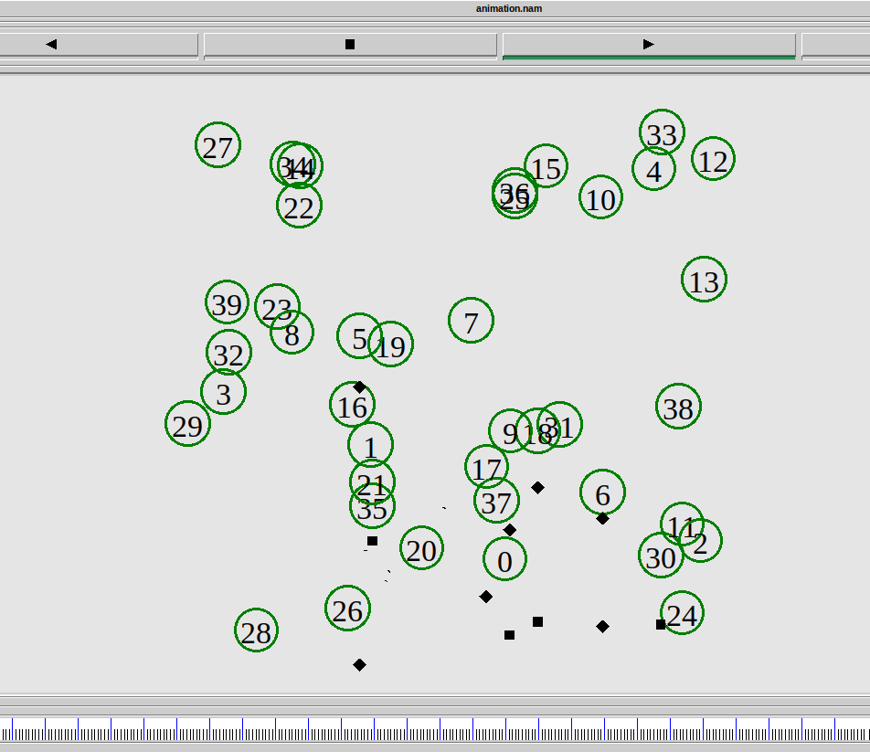 
======================

IEEE 802.15. 4 
--------------

IEEE standard 802.15.4 intends to offer the fundamental lower network
layers of a type of wireless personal area network (WPAN) which focuses
on low-cost, low-speed ubiquitous communication between devices. It can
be contrasted with other approaches, such as Wi-Fi, which offer more
bandwidth and requires more power. The emphasis is on very low cost
communication of nearby devices with little to no underlying
infrastructure, intending to exploit this to lower power consumption
even more.

IEEE 802.15. 4 is a low-data rate wireless personal area network and is
the PHY and MAC layer used by many IoT protocols, such as ZigBee, and
WirelessHART.

The basic framework conceives a 10-meter communications range. Tradeoffs
are possible to favor more radically embedded devices with even lower
power requirements, through the definition of not one, but several
physical layers. Lower transfer rates of 20 and 40 kbit/s were initially
defined..

The MAC Type 
------------

The medium access control (MAC) enables the transmission of MAC frames
through the use of the physical channel. Besides the data service, it
offers a management interface and itself manages access to the physical
channel and network beaconing. It also controls frame validation,
guarantees time slots and handles node associations. Finally, it offers
hook points for secure services. The  IEEE  802.15.4  MAC  protocol  has
 been  optimized  for  Low  Power  consumption. It is tailored to the
fact that most IEEE 802.15.4 PHYs only support frames of up to 127
bytes.

The mac 802.15.4 is set in NS2 by  -

\$ns node-config -macType Mac/802\_15\_4 \\            \
                              -phyType Phy/WirelessPhy/802\_15\_4

Destination-Sequenced Distance-Vector Routing (DSDV)

Destination-Sequenced Distance-Vector Routing (DSDV) is a table-driven
routing scheme for ad hoc mobile networks based on the Bellman–Ford
algorithm. The main contribution of the algorithm was to solve the
routing loop problem. Each entry in the routing table contains a
sequence number, the sequence numbers are generally even if a link is
present; else, an odd number is used. The number is generated by the
destination, and the emitter needs to send out the next update with this
number. Routing information is distributed between nodes by sending full
dumps infrequently and smaller incremental updates more frequently. If a
router receives new information, then it uses the latest sequence
number. If the sequence number is the same as the one already in the
table, the route with the better metric is used. Stale entries are those
entries that have not been updated for a while. Such entries as well as
the routes using those nodes as next hops are deleted.

The DSDV is set in NS2 by -

\$ns node-config -adhocRouting DSDV

UDP
----

 A UDP agent accepts data in variable size chunks from an application,
and segments the data if needed. UDP packets also contain a
monotonically increasing sequence number and an RTP timestamp. Although
real UDP packets do not contain sequence numbers or timestamps, this
sequence number does not incur any simulated overhead, and can be useful
for trace file analysis or for simulating UDP-based applications.

UDP in ns2 is set by-

       \# create agent

        set udp(\$i) [new Agent/UDP]

        \# attach to nodes

        \$ns attach-agent \$node(\$src) \$udp(\$i)

 

Exponential Traffic Generator

Exponential Traffic Generator generates traffic according to an
Exponential On/Off distribution. Packets are sent at a fixed rate during
on periods, and no packets are sent during off periods. Both on and off
periods are taken from an exponential distribution. Packets are constant
size.

Exponential Traffic Generator is set in NS2 by-

        \# Traffic generator

        set exptrf [new Application/Traffic/Exponential]

        \$exptrf set packetSize\_ 64

        \$exptrf set rate\_ 10k

        \$exptrf attach-agent \$udp(\$i)

Graphs:

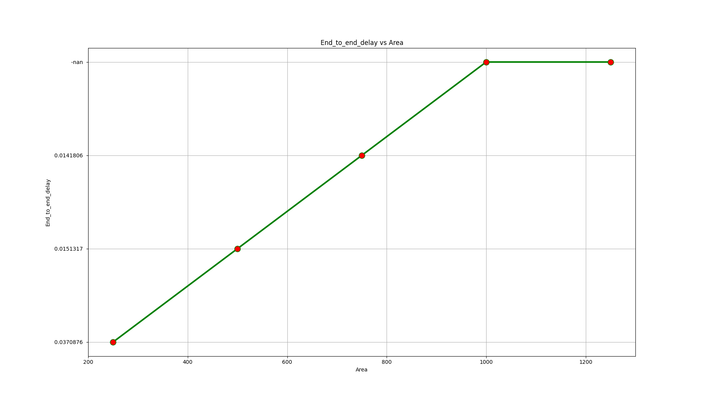Graphs: End to End delay vs
Area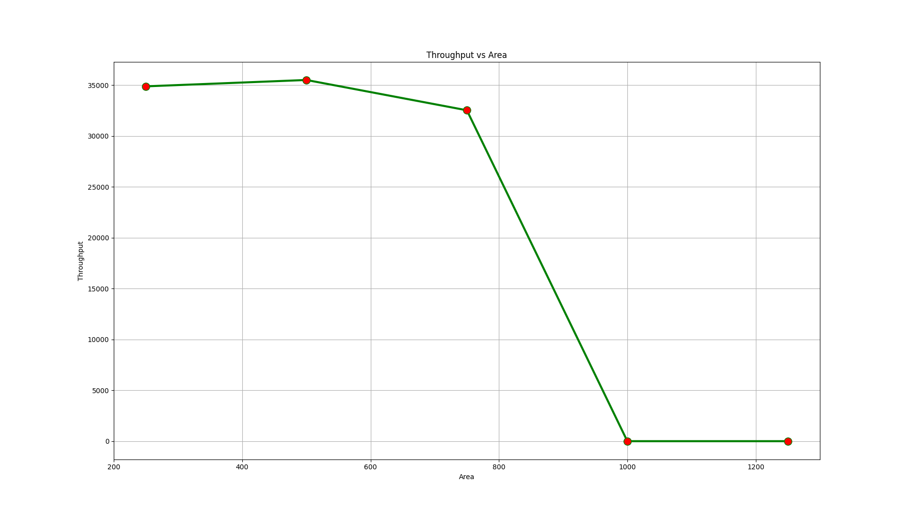Graphs: Throughput vs
Area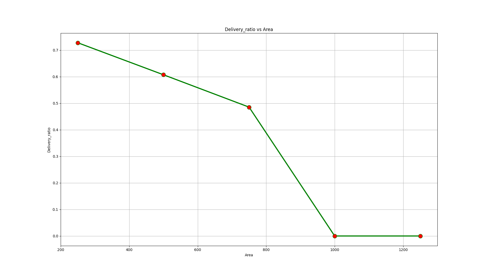Graph: Delivery Ratio vs
Area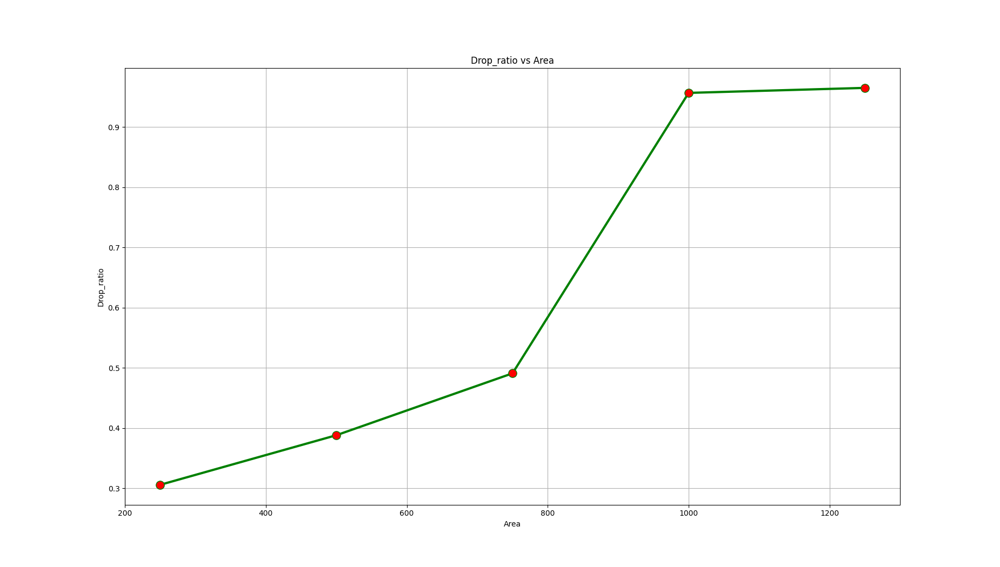Graph: Drop Ratio vs
Area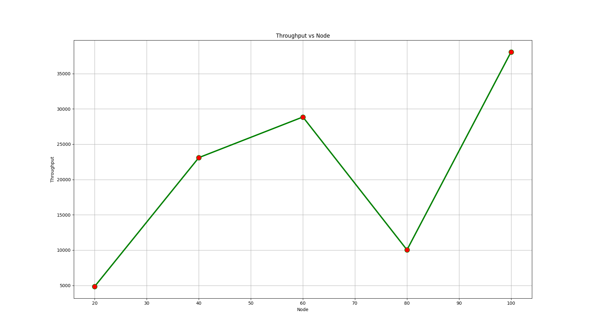Graphs Throughput vs
Node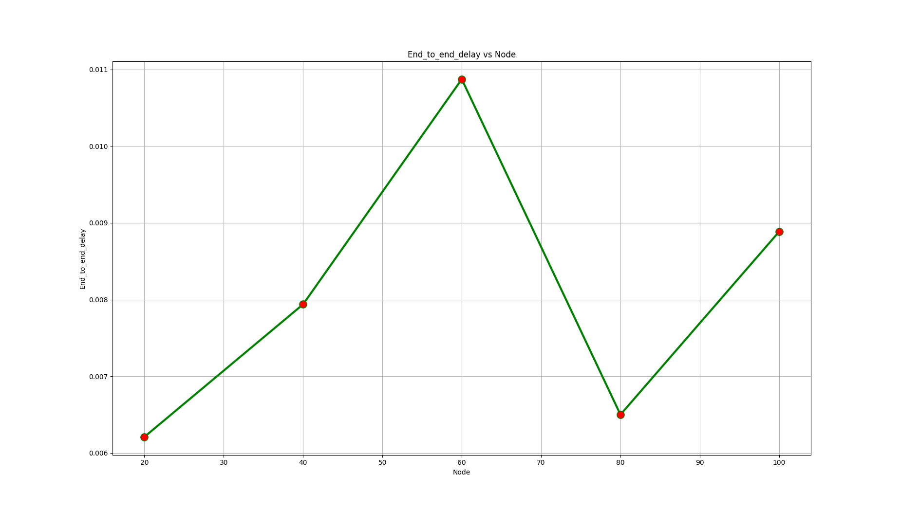Graph: End to End delay vs
Node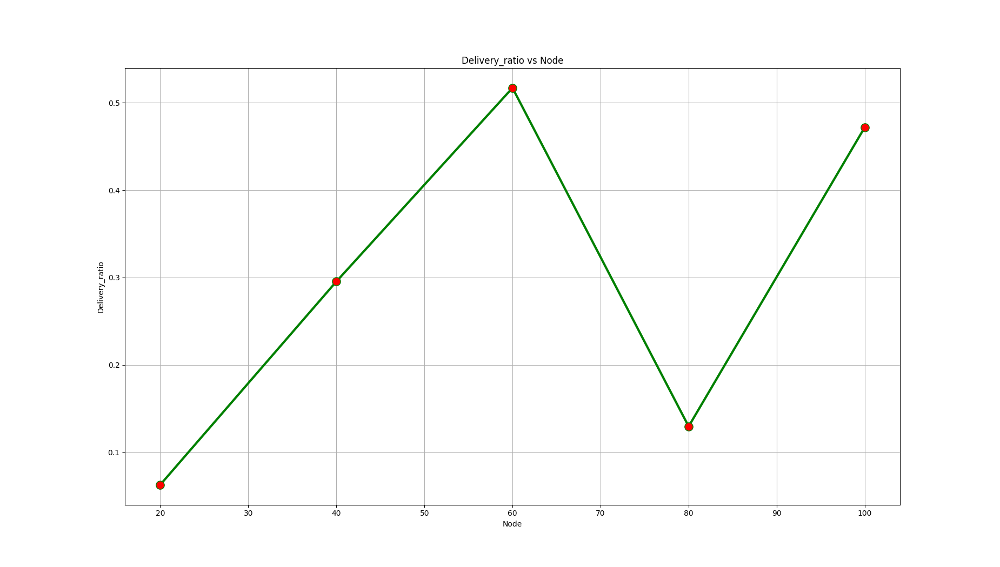Graph: Delivery Ratio vs
Node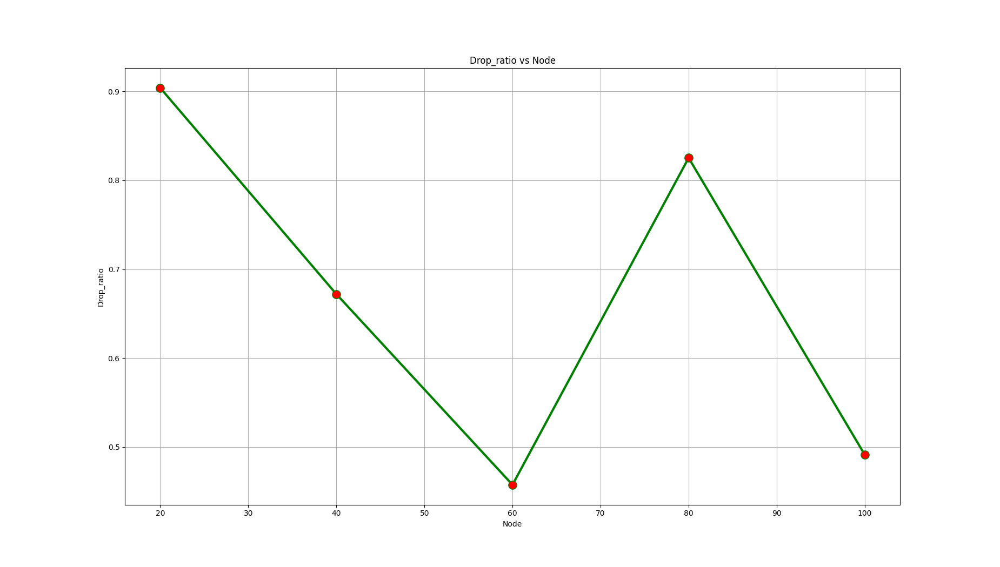Graph: Drop Ratio vs
Node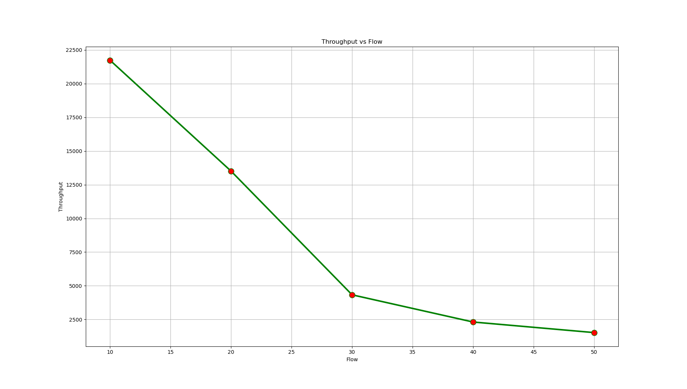Graph: Throughput vs
Flow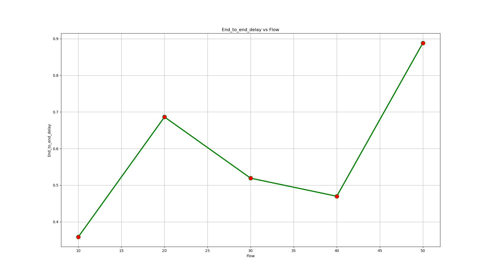Graph: End to End delay vs Flow

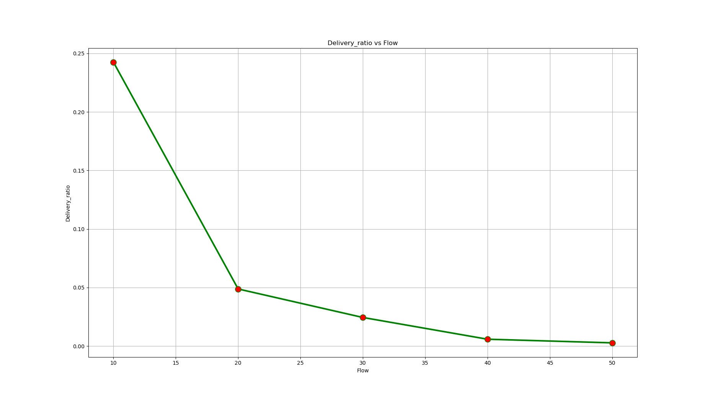

Graph: Delivery Ratio vs Flow

Graph: Drop Ratio vs Flow
