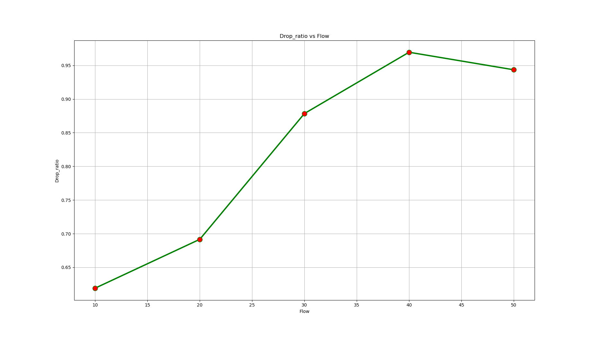

<html><head><meta content="text/html; charset=UTF-8" http-equiv="content-type"></head><body class="c11">

CSE 322 Computer Networking Sessional

Network Simulator 2 Offline

Abir Mohammad Turza (1605104)

<h1 class="c2 c15" id="h.vydniszftb1n"></h1><h2 class="c2 c18" id="h.uidt5gbwhr7g">IEEE 802.15. 4</h2>
IEEE standard 802.15.4 intends to offer the fundamental lower network layers of a type of wireless personal area network (WPAN) which focuses on low-cost, low-speed ubiquitous communication between devices. It can be contrasted with other approaches, such as Wi-Fi, which offer more bandwidth and requires more power. The emphasis is on very low cost communication of nearby devices with little to no underlying infrastructure, intending to exploit this to lower power consumption even more.

IEEE 802.15. 4 is a low-data rate wireless personal area network and is the PHY and MAC layer used by many IoT protocols, such as ZigBee, and WirelessHART.

The basic framework conceives a 10-meter&nbsp;communications range. Tradeoffs are possible to favor more radically embedded devices with even lower power requirements, through the definition of not one, but several physical layers. Lower transfer rates of 20 and 40 kbit/s&nbsp;were initially defined..
<h2 class="c18 c2" id="h.la5jp5tnimjw">The MAC Type</h2>
The medium access control (MAC) enables the transmission of MAC frames through the use of the physical channel. Besides the data service, it offers a management interface and itself manages access to the physical channel and network beaconing. It also controls frame validation, guarantees time slots and handles node associations. Finally, it offers hook points for secure services. The &nbsp;IEEE &nbsp;802.15.4 &nbsp;MAC &nbsp;protocol &nbsp;has &nbsp;been &nbsp;optimized &nbsp;for &nbsp;Low &nbsp;Power &nbsp;consumption. It is tailored to the fact that most IEEE 802.15.4 PHYs only support frames of up to 127 bytes.

The mac 802.15.4 is set in NS2 by &nbsp;- 

$ns node-config -macType Mac/802_15_4 \ &nbsp; &nbsp; &nbsp; &nbsp; &nbsp; &nbsp;  &nbsp; &nbsp; &nbsp; &nbsp; &nbsp; &nbsp; &nbsp; &nbsp; &nbsp; &nbsp; &nbsp; &nbsp; &nbsp; &nbsp; &nbsp;-phyType Phy/WirelessPhy/802_15_4

Destination-Sequenced Distance-Vector Routing (DSDV)

Destination-Sequenced Distance-Vector Routing (DSDV) is a table-driven routing scheme for ad hoc mobile networks based on the Bellman&ndash;Ford algorithm. The main contribution of the algorithm was to solve the routing loop problem. Each entry in the routing table contains a sequence number, the sequence numbers are generally even if a link is present; else, an odd number is used. The number is generated by the destination, and the emitter needs to send out the next update with this number. Routing information is distributed between nodes by sending full dumps infrequently and smaller incremental updates more frequently. If a router receives new information, then it uses the latest sequence number. If the sequence number is the same as the one already in the table, the route with the better metric is used. Stale entries are those entries that have not been updated for a while. Such entries as well as the routes using those nodes as next hops are deleted.

The DSDV is set in NS2 by -

$ns node-config -adhocRouting DSDV

&nbsp;UDP

&nbsp;A UDP agent accepts data in variable size chunks from an application, and segments the data if needed. UDP packets also contain a monotonically increasing sequence number and an RTP timestamp. Although real UDP packets do not contain sequence numbers or timestamps, this sequence number does not incur any simulated overhead, and can be useful for trace file analysis or for simulating UDP-based applications.

UDP in ns2 is set by-

&nbsp; &nbsp; &nbsp; &nbsp;# create agent

&nbsp; &nbsp; &nbsp; &nbsp; set udp($i) [new Agent/UDP]

&nbsp; &nbsp; &nbsp; &nbsp; # attach to nodes

&nbsp; &nbsp; &nbsp; &nbsp; $ns attach-agent $node($src) $udp($i) 

&nbsp;

Exponential Traffic Generator

Exponential Traffic Generator generates traffic according to an Exponential On/Off distribution. Packets are sent at a fixed rate during on periods, and no packets are sent during off periods. Both on and off periods are taken from an exponential distribution. Packets are constant size.

Exponential Traffic Generator is set in NS2 by-

&nbsp; &nbsp; &nbsp; &nbsp; # Traffic generator

&nbsp; &nbsp; &nbsp; &nbsp; set exptrf [new Application/Traffic/Exponential]

&nbsp; &nbsp; &nbsp; &nbsp; $exptrf set packetSize_ 64

&nbsp; &nbsp; &nbsp; &nbsp; $exptrf set rate_ 10k

&nbsp; &nbsp; &nbsp; &nbsp; $exptrf attach-agent $udp($i)

Graphs:

Graphs: End to End delay vs AreaGraphs: Throughput vs AreaGraph: Delivery Ratio vs AreaGraph: Drop Ratio vs AreaGraphs Throughput vs NodeGraph: End to End delay vs NodeGraph: Delivery Ratio vs NodeGraph: Drop Ratio vs NodeGraph: Throughput vs FlowGraph: End to End delay vs Flow

Graph: Delivery Ratio vs Flow

Graph: Drop Ratio vs Flow
</body></html>